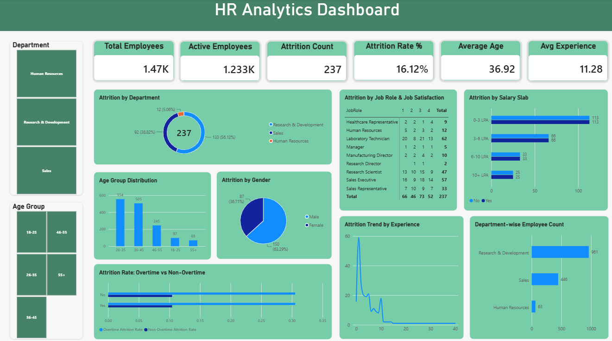

# HR Analytics Dashboard

## Objective
Analyze employee attrition data to identify key drivers of turnover and provide actionable recommendations.

## Tools Used
- Power BI Desktop
- DAX (Data Analysis Expressions)

## Key Findings
- Overall attrition rate: 16.1%
- Research & Development department has the highest attrition (56.12%)
- Employees working overtime have a 3x higher attrition rate
- Entry-level employees (0-3 LPA) are most likely to leave

## Recommendations
1. Implement overtime reduction policies
2. Review compensation for entry-level employees
3. Create career progression paths for high-risk roles

## Dashboard Preview

## Files
- `hr_analytics.pbix` — Power BI file
